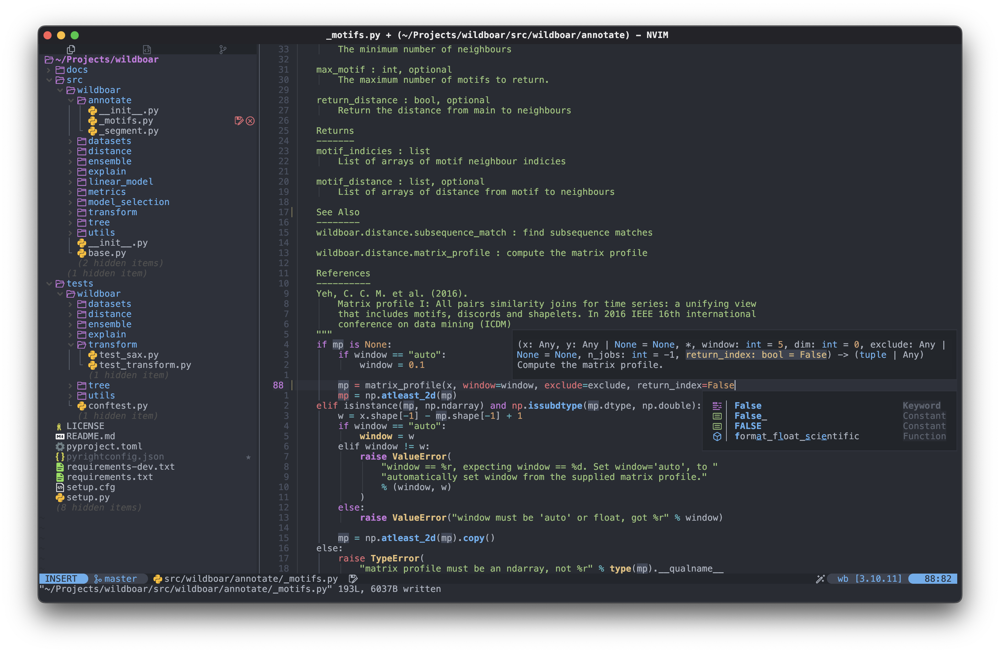
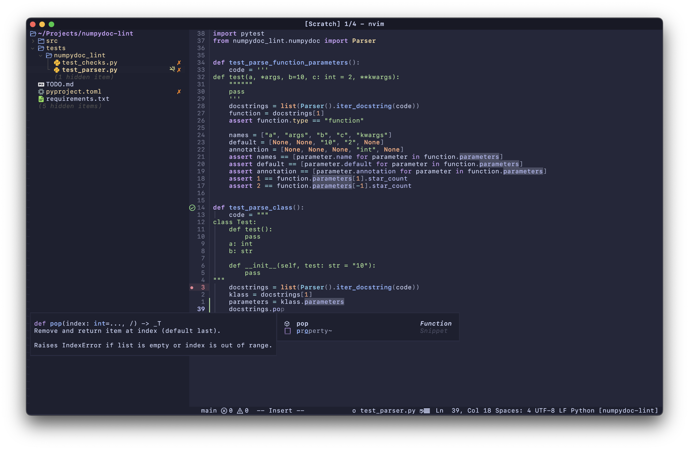

# Isak Samsten's Neovim config

## Installation

Clone the repository

    https://github.com/isaksamsten/nvim-config.git

Start Neovim and sync the plugins with `:Lazy restore`.

## Features

- Automatically format on save. Enabled by default, to default to disable add a
  file `.disable-auto-format` to the root of your project.

- All LSP features. LSP servers are automatically setup for the
  languages I use.

- Debug support. Enabled for the languages I use.

- Treesitter syntax higlighting.

- Improved Neotree sidebar toggling.

- Customized catppuccin color scheme.

- Customized gutter with git signs.

## Keybindings

### Completion

| Keymap        | Action                             |
| ------------- | ---------------------------------- |
| `C-k`, `Up`   | Select previous                    |
| `C-j`, `Down` | Select next                        |
| `C-Space`     | Complete/Abort                     |
| `Enter`       | Accept selected                    |
| `Tab`         | Confirm, complete and jump snippet |
| `S-Tab`       | Jump snippet backwards             |

### Comments

| Mode | Keymap                  | Actiom            |
| ---- | ----------------------- | ----------------- |
| `n`  | `gc`+`c` or text-object | Add comment       |
| `v`  | `gc`                    | Add comment       |
| `n`  | `C-;`                   | Add documentation |

### Test

| Keymap       | Action             |
| ------------ | ------------------ |
| `<leader>tr` | Run current test   |
| `<leader>tR` | Run current tests  |
| `<leader>td` | Debug current test |
| `<leader>ts` | Open summary       |
| `<leader>to` | Open output        |
| `Shift-F4`   | Reveal output      |

### Debugging

| Keymap      | Action                        |
| ----------- | ----------------------------- |
| `F9`        | Toggle breakpoint             |
| `S-F9`      | Toggle conditional breakpoint |
| `F5`        | Start/Continue                |
| `Ctrl-F5`   | Run last                      |
| `Shift-F5`  | Stop                          |
| `F10`       | Step over                     |
| `F11`       | Step into                     |
| `Shift-F11` | Step out                      |

### LSP

| Keymap          | Action                |
| --------------- | --------------------- |
| `K`             | Hover                 |
| `gd`            | Go to definition      |
| `gD`            | Go to declaration     |
| `gi`            | Go to implementation  |
| `go`            | Go to type definition |
| `gr`            | Go to references      |
| `<leader>Enter` | Rename                |
| `g.`            | Code action           |
| `<leader>F`     | Format document       |
| `gq`            | Format range          |
| `g,`            | Show diagnostic popup |
| `[,`            | Previous diagnostic   |
| `],`            | Next diagnostic       |
| `<leader>p`     | Find symbol           |

### Toggle

| Keymap       | Action                |
| ------------ | --------------------- |
| `<leader>uf` | Toggle format on save |
| `<leader>ub` | Toggle Git blame      |

### Sidebar

| Keymap      | Action                         |
| ----------- | ------------------------------ |
| `<leader>e` | Toggle focus explorer          |
| `<leader>b` | Toggle left sidebar visibility |
| `<leader>P` | Toggle focus symbols           |
| `<leader>l` | Toggle (left) status           |
| `<leader>j` | Toggle (bottom) panel          |

### Git

| Mode    | Keymap       | Action          |
| ------- | ------------ | --------------- |
| `n`     | `<leader>gg` | Git status      |
| `n`     | `<leader>gv` | File history    |
| `n`     | `<leader>gV` | Branch history  |
| `n`,`v` | `<leader>gs` | Stage           |
| `n`,`v` | `<leader>gs` | Stage           |
| `n`,`v` | `<leader>gr` | Reset           |
| `n`,`v` | `<leader>gr` | Reset           |
| `n`     | `<leader>gS` | Stage buffer    |
| `n`     | `<leader>gR` | Reset buffer    |
| `n`     | `<leader>gb` | Blame line      |
| `n`     | `<leader>gp` | Preview changes |
| `n`     | `<leader>gR` | Reset buffer    |
| `n`     | `<leader>gd` | Diff            |
| `n`     | `<leader>gD` | Diff buffer     |
| `o`,`x` | `ig`         | Select change   |

### Buffers, windows and tabs

| Keymap             | Action                                      |
| ------------------ | ------------------------------------------- |
| `<leader>q`        | Close buffer                                |
| `<C-h>`            | Left window                                 |
| `<C-j>`            | South window                                |
| `<C-k>`            | North window                                |
| `<C-l>`            | Right window                                |
| `<leader><leader>` | Switch buffer                               |
| `<leader>f`        | Find file                                   |
| `<leader>s`        | Search files                                |
| `<leader>Sw`       | Search files for word under cursor branches |
| `<leader>Ss`       | Search buffer                               |
| `<leader>Sb`       | Search git branches                         |
| `<leader>p`        | Search symbols                              |
| `[t`               | Previous tab                                |
| `]t`               | Next tab                                    |
| `<M-w>`            | Close tab                                   |
| `<M-t>`            | New tab                                     |
| `<M-1>`            | Go to tab #1                                |
| `<M-2>`            | Go to tab #2                                |
| `<M-3>`            | Go to tab #3                                |
| `<M-4>`            | Go to tab #4                                |

Default Keybindings as set by `mini.ai`, `mini.move` and `flash`.

## Screenshots

I use two different themes that I have customized to my liking.

### OneDark

Color scheme: [OneDark Pro](https://github.com/olimorris/onedarkpro.nvim),
Terminal: [Kitty](https://github.com/kovidgoyal/kitty) forked with [better
macOS title bar](https://github.com/isaksamsten/kitty), Font: SF Mono

### Catppuccin

Color scheme: [Catppuccin](https://github.com/catppuccin/nvim),
Terminal: [Kitty](https://github.com/kovidgoyal/kitty) forked with [better
macOS title bar](https://github.com/isaksamsten/kitty), Font: SF Mono

#### Dark

#### Light

