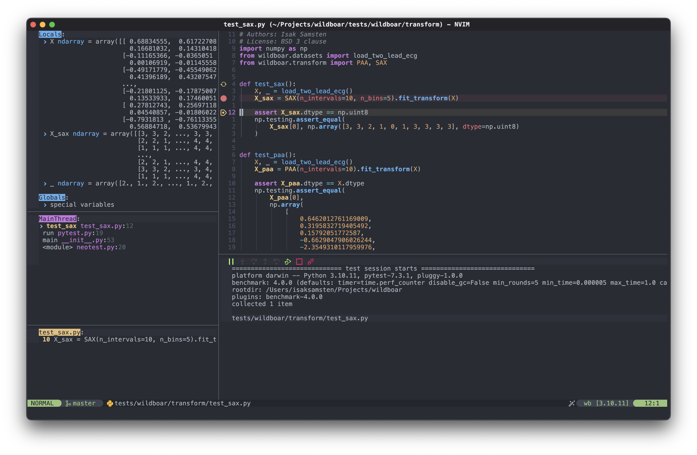
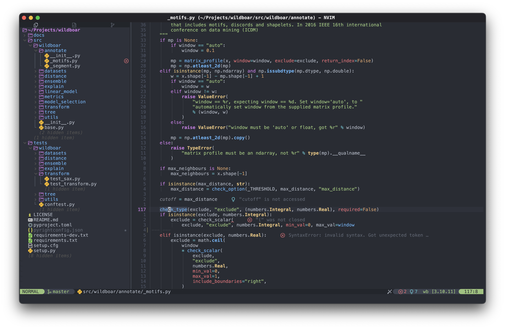
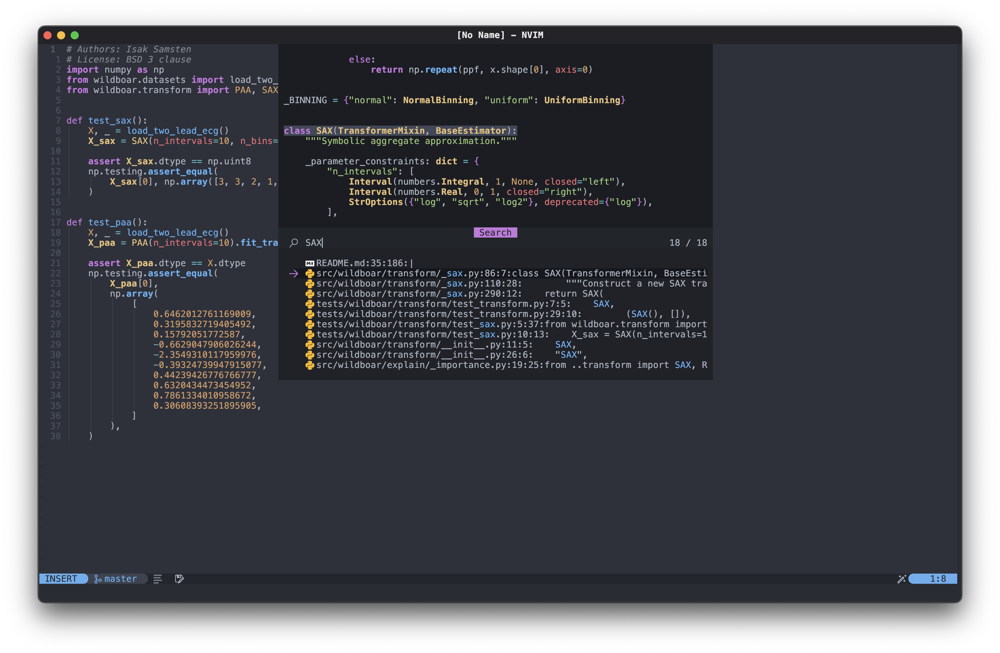
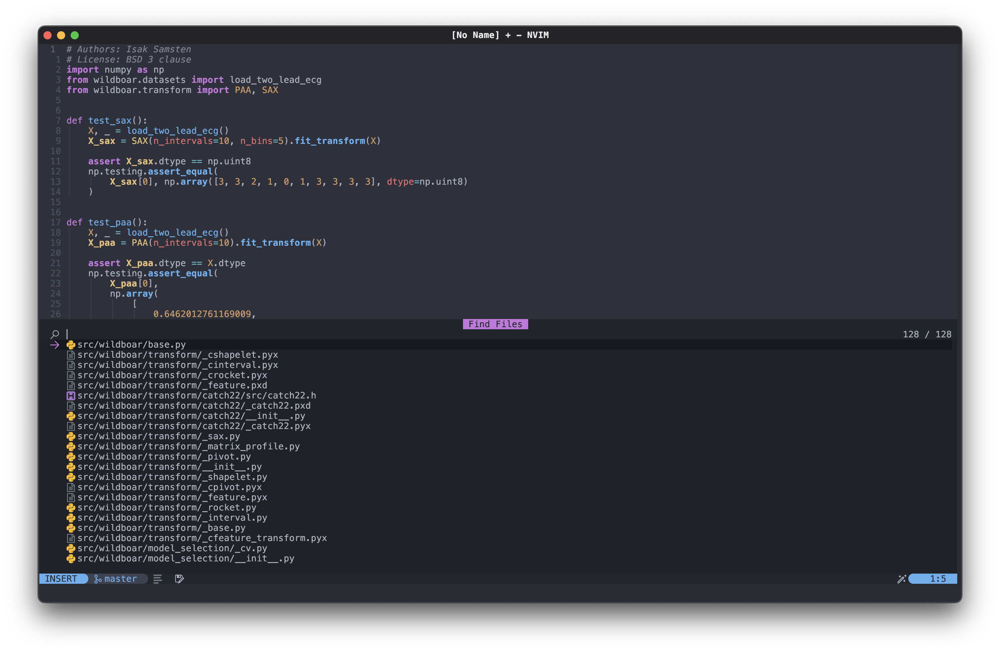
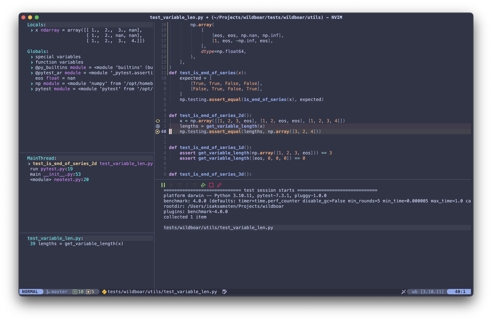
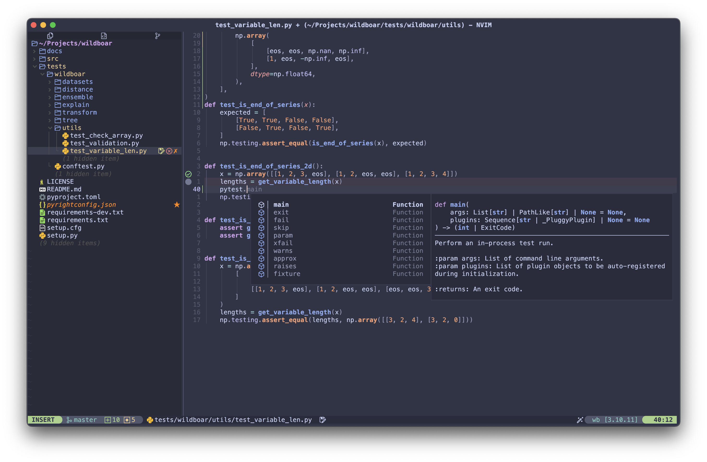
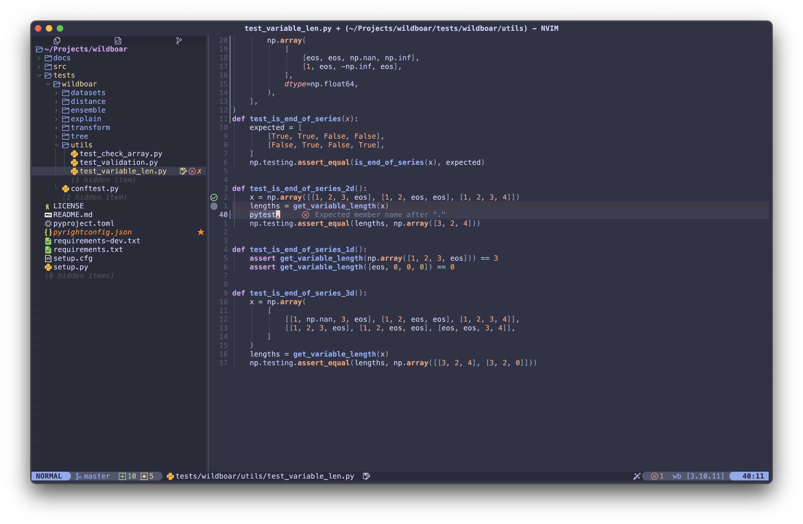
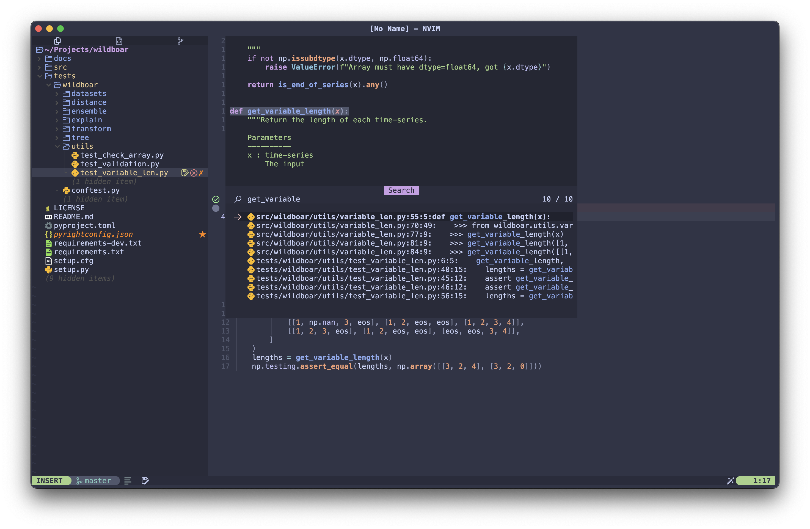
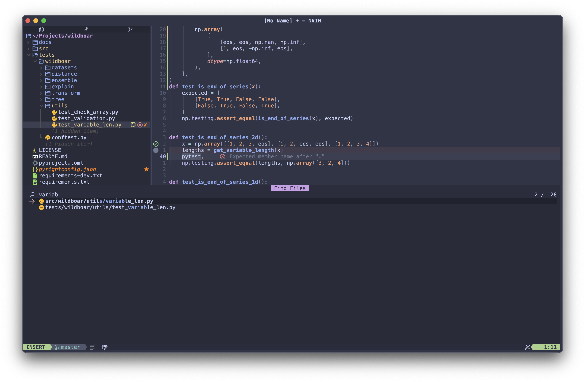

# Isak Samsten's Neovim config

## Installation

Clone the repository

    https://github.com/isaksamsten/nvim-config.git

Start Neovim and sync the plugins with `:Lazy restore`.

## Screenshots

I use two different themes that I have customized to my liking.

### OneDark

Color scheme: [OneDark Pro](https://github.com/olimorris/onedarkpro.nvim),
Terminal: [Kitty](https://github.com/kovidgoyal/kitty) forked with [better
macOS title bar](https://github.com/isaksamsten/kitty), Font: Meslo LG S

### Catppuccin

Color scheme: [Catppuccin](https://github.com/catppuccin/nvim),
Terminal: [Kitty](https://github.com/kovidgoyal/kitty) forked with [better
macOS title bar](https://github.com/isaksamsten/kitty), Font: Meslo LG S

